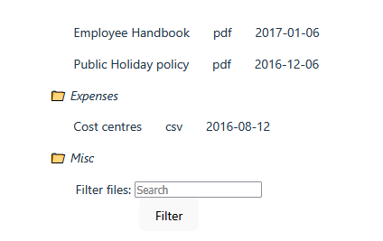

# File Browser
*React/Typescript*

A basic file browser which can display the name, file type and date added of a list of files uploaded to a web server. Also has the option to filter by filename and open/close folders.


## Requirements
Requires npm 10.1.0 or greater.

## Running web page and tests
To install requirements and launch the website, run the following commands from the root directory and copy the localhost link into a web browser. The test input data is hardcoded into the app for now however this could be refactored later.
```
npm install
npm run dev
```

To launch the tests, run this command:
```
npm test
```

## Finishing the website
An additional step would be to allow the user to sort files by their name/size/date they were added. To do this, a custom sorting method could be written and used before the .filter() and .map() stages in App.tsx. As we are using custom data types for files/folders, we could write a seperate sorting method for each parameter (e.g. a function to sort by name, another one for date and another for size). The function could step through each item in the input data in sequence and do a comparison with the remaining items in the list to find out if it should be placed before/after them.